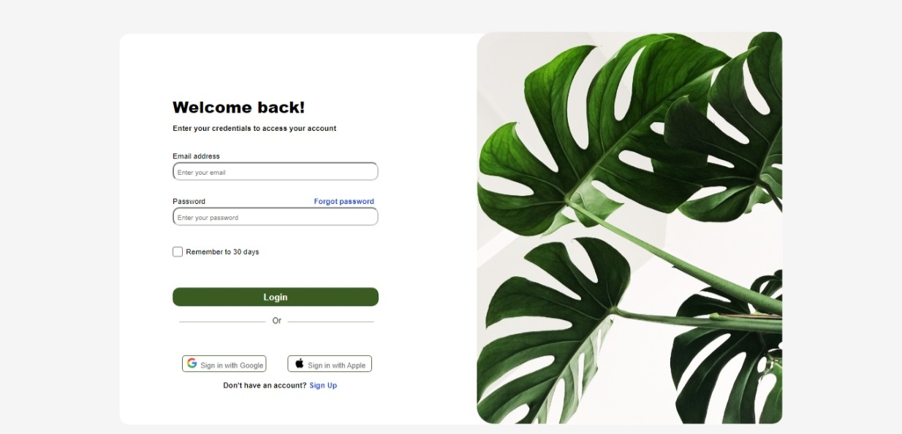

### TP-HTML-CSS

Mon projet comprend deux page relié par un lien.
simple et facile à utiliser; 
La page login est composer de 3 input; un button de connexion et deux boutton pour se connecter avec google ou apple;
Il suffit de remplir le formulaire en saisant son address email et mot de passe ensuite cliquer sur login pour de connecter; à defaut d'un compte il faut cliquer sur signup pour créer un nouveau compte en saissant un nom; un email; et un mot de passe.

### depot TP-HTML-CSS
Mon depot est composé de :
1. un ficher index.html
2. un fichier singup.html
3. un fichier style. css
4. un fichier READEME.md
5. deux fichier svg
6. un dossier image

### technologie utilisés :
1. HTML
2. CSS 

